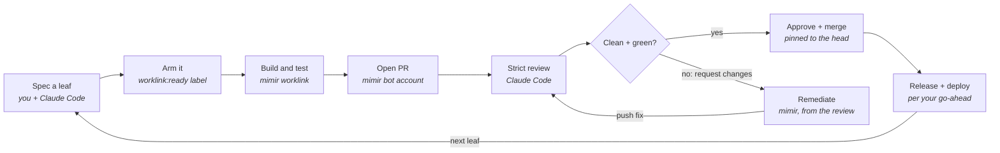

# Mimir + Coding Agent Dev Loop Runbook

As of 2026-10-08

A mimir agent builds your issues into pull requests on its own. Your local coding agent, Claude Code, writes the specs, reviews every PR strictly, and merges, releases and deploys only what passes. This runbook sets up that loop on your own GitHub repo.

## The loop at a glance



Nothing merges until an independent strict review passes. Three actors split the work:
- **You** decide what gets built and grant releases and deploys.
- **Your local coding agent** (Claude Code) writes specs, reviews every PR adversarially, and merges only a reviewed head with green CI.
- **The mimir agent** builds each armed issue in its own checkout, opens the PR from its own bot account, and pushes fixes when a review requests changes.

| Actor | Does | Never does |
| --- | --- | --- |
| You | Approve what to build, grant each release and deploy | Merge unreviewed code |
| Claude Code (local) | Spec leaves, strict review, merge, release, deploy under a grant | Write the feature code it reviews; deploy without a per-release grant |
| mimir agent | Build leaves, open PRs, remediate review feedback | Approve or merge its own PRs |
| GitHub | Enforce one approving review, required checks, stale-review dismissal | — |

## Prerequisites

You need two GitHub identities, one always-on host for the mimir agent, and your own machine for Claude Code. Budget about two hours for first-time setup.

| Item | What | Notes |
| --- | --- | --- |
| Your GitHub account | Owns or admins the repo; approves and merges | Claude Code acts as this account for reviews and merges |
| Bot GitHub account | A separate user, e.g. `yourname-bot` | Collaborator with **Write** on the repo. Its classic PAT needs `repo` scope; private repos 404 without it |
| Agent host | Linux or macOS box that stays on, with Docker | Runs the mimir agent and its builds. Allow 8 CPUs, 16 GB RAM and 60 GB+ free disk |
| Your machine | Claude Code, `gh`, `git`, `uv` | Runs reviews: full test suites in worktrees |
| Model access | A subscription or API key for the agent | e.g. a Codex/ChatGPT plan (`codex-plus`), Claude Max (`claude-code`) or an API key |
| mimir | `pip install "mimir-agent[<extras>]"` | Extras: `codex-plus`, `claude-code`, `anthropic`, `openai`, `discord`, `slack`, `mcp`. Worklink and GitHub tools are in the base package |
| chainlink | The issue tracker the queue reads | Built into the Docker image by `mimir scaffold-docker`; set `CHAINLINK_BIN` to use your own build |
| Chat bridge (optional) | Discord or Slack | How you talk to the agent and get its alerts |

Two accounts matter because branch protection requires an approving review from someone other than the PR author: the bot authors, you approve. Never give Claude Code the bot's token.

## Set up the GitHub repo

Branch protection is what makes the loop safe. The bot can open PRs but can't merge them, and every merge needs your account's approval on the current head plus green CI.

**1. Add the bot as a collaborator** with Write access, then accept the invite while logged in as the bot.

```bash
gh api -X PUT repos/<owner/repo>/collaborators/<bot-login> -f permission=push
```

**2. Protect `main`.** Require one approving review, dismiss stale approvals on push, include admins, and list your CI job names as required checks.

```bash
gh api -X PUT repos/<owner/repo>/branches/main/protection --input - <<'EOF'
{
  "required_status_checks": {"strict": false, "contexts": ["pytest (3.12)", "frontend"]},
  "enforce_admins": true,
  "required_pull_request_reviews": {"required_approving_review_count": 1, "dismiss_stale_reviews": true},
  "restrictions": null
}
EOF
```

List the exact check names from a recent PR with `gh pr checks <n>`. Without required checks, a merge can land before CI finishes.

**3. Make CI cover what reviews rely on.** At minimum:
- the full test suite on every supported Python;
- a lockfile check (`uv lock --check`);
- any packaging or frontend build.

Pin every third-party Action to a 40-character commit SHA.

**4. Turn on security features:** Dependabot alerts and security updates, secret scanning with push protection, and private vulnerability reporting.

```bash
gh api -X PUT repos/<owner/repo>/vulnerability-alerts
gh api -X PUT repos/<owner/repo>/automated-security-fixes
gh api -X PATCH repos/<owner/repo> --input - <<'EOF'
{"security_and_analysis": {"secret_scanning": {"status": "enabled"},
  "secret_scanning_push_protection": {"status": "enabled"}}}
EOF
```

**5. Have Dependabot watch every dependency.** Give the protocols and SDKs your agent depends on their own daily group, so a new major version can't slip in unnoticed.

```yaml
# .github/dependabot.yml (the config mimir itself runs)
version: 2
updates:
  - package-ecosystem: "uv"
    directory: "/"
    schedule: {interval: "daily"}
    # A release inside your declared range only moves uv.lock; a release outside it
    # (past a `<2` cap or an exact `==` pin) widens the requirement, so it always opens a PR.
    versioning-strategy: "increase-if-necessary"
    allow:
      - dependency-type: "direct"
    open-pull-requests-limit: 10
    groups:
      agent-protocols:            # first matching group wins: these never get buried
        patterns: ["mcp", "agent-client-protocol"]
      python-minor-patch:
        patterns: ["*"]
        update-types: ["minor", "patch"]
      # majors of everything else: one PR each
  - package-ecosystem: "npm"
    directory: "/"
    schedule: {interval: "weekly"}
    groups:
      npm-minor-patch: {patterns: ["*"], update-types: ["minor", "patch"]}
  - package-ecosystem: "docker"
    directory: "/"
    schedule: {interval: "weekly"}
  - package-ecosystem: "github-actions"
    directory: "/"
    schedule: {interval: "weekly"}
```

**6. Releases (if you publish to PyPI).** Use trusted publishing:
- a `publish.yml` workflow triggered by `v*` tag pushes;
- running in a GitHub environment named `pypi` with a required reviewer;
- a pending publisher registered on PyPI for that workflow.

No API token is stored anywhere. The environment's approval is the release gate.

## Set up the mimir agent

The agent needs a home directory, a checkout of your repo, two config files, the bot's GitHub token, and two pollers. One poller dispatches armed issues to builds; the other turns review comments into fixes. The mimir repo's `docs/code-building-pipeline.md` and `docs/configuration.md` are the reference for every key below.

Every `docker compose` command in this section runs **from the agent home** (`cd ~/agents/my-agent`), which is the Compose project directory: its `.env` drives Compose interpolation, and `compose.env` is the container's runtime environment.

**1. Install mimir and create a home.**

```bash
pip install "mimir-agent[codex-plus,discord]"      # pick your model and chat extras
mimir setup --home ~/agents/my-agent                # add --model / --subscription to choose a model
# The container sees this home at /mimir-home, but setup wrote saga's database paths as
# absolute host paths; point them at the container path or the agent can't open its memory.
sed -i.bak -E 's#^(db_path|metrics_db_path) = ".*/\.mimir/#\1 = "/mimir-home/.mimir/#' ~/agents/my-agent/saga.toml
```

**2. Install the two skills that run the loop.** Do this before scaffolding: `scaffold-docker` reads installed skills for their Dockerfile fragments and the environment keys they need.

```bash
mimir skills install chainlink-orchestrator --home ~/agents/my-agent   # poller: worklink-ready-queue, every 10 min
mimir skills install github-poller --home ~/agents/my-agent            # poller: github-activity, every 15 min
```

- **`worklink-ready-queue`** reads `chainlink issue ready`, claims issues labelled `worklink:ready`, and starts `mimir worklink run <id> --autonomous` for each. It needs `WORKLINK_REPO` set; see the skill's `pollers.json`.
- **`github-activity`** turns reviews, CI failures and merge conflicts on the bot's own PRs into agent turns. A `CHANGES_REQUESTED` review produces a fix and a push, then a re-requested review.
- **Environment filtering:** pollers strip environment variables ending in `_TOKEN`, `_API_KEY`, `_SECRET` or `_PASSWORD`, and anything starting with `MIMIR_`, unless the poller's `pass_env` lists them.
  - Tune `pass_env` in `<home>/pollers-overrides.yaml`.
  - A token missing from `pass_env` silently falls back to `gh auth token`, which may be the wrong account.

**3. Add your test runner to the image.** The PyPI-mode image deliberately ships without `uv`, so `uv run pytest -q` can't run inside the container until you add it. `scaffold-docker` stitches every `<home>/skills/<name>/dockerfile.fragment` into the generated Dockerfile (as root, before the runtime user is created), so add one fragment for it. Pin the version you test with:

```bash
mkdir -p ~/agents/my-agent/skills/uv-runtime
cat > ~/agents/my-agent/skills/uv-runtime/dockerfile.fragment <<'FRAG'
# uv for the repository test gate (uv run pytest).
COPY --from=ghcr.io/astral-sh/uv:0.12.18 /uv /uvx /usr/local/bin/
FRAG
```

The directory has no `SKILL.md`, so the agent never loads it as a skill; only the scaffold reads it. If your tests use another runner, install that instead, and use it in `test_command` below.

**4. Generate the Docker files.** Re-run this whenever you install or remove a skill or fragment; it rewrites `Dockerfile` and `compose.yml` and merges new keys into `compose.env` without touching your values.

```bash
mimir scaffold-docker --home ~/agents/my-agent --service-name my-agent --mode pypi \
  --extras "codex-plus,discord,mcp"
```

The image runs mimir under `tini` as the non-root user `mimir` (UID/GID `1000` unless you pass `USER_UID`/`USER_GID` build args) and includes the chainlink CLI. The compose file binds the web port to 127.0.0.1 and sets `MIMIR_WEB_HOST=0.0.0.0` inside the container. Set `MIMIR_API_KEY` if you expose the port any further.

> **Known issue (mimir 0.8.5 to 0.9.6):** the generated `compose.yml` fails to parse (`yaml: line 28, column 29: mapping values are not allowed in this context`). A `\n` in a usage comment is emitted as a real newline. Until the fix ships, rejoin that comment line after each scaffold run:
>
> ```bash
> cd ~/agents/my-agent && python3 - <<'PY'
> p = "compose.yml"; s = open(p).read()
> open(p, "w").write(s.replace("printf 'MIMIR_ENABLE_CLAUDE_CODE=1\n'", "printf 'MIMIR_ENABLE_CLAUDE_CODE=1\\n'"))
> PY
> docker compose config --services     # must print your service name
> ```

**5. Clone your repo and create the PR checkout lease root, side by side in one directory.** Worklink never clones for you, and the checkout's `origin` must match the slug. Remediation needs `MIMIR_PR_CHECKOUT_LEASE_ROOT`: an existing, non-symlink directory, writable by the runtime user, on the **same filesystem as the repo** (leases use hardlinks). mimir checks it at startup and does not create it or fix its ownership.

```bash
mkdir -p ~/agents/my-agent-work/.pr-leases
git clone https://github.com/<owner/repo>.git ~/agents/my-agent-work/<repo>
```

The PyPI scaffold mounts only the agent home, so mount the work directory with a `compose.override.yml` in the agent home. Compose merges it automatically, and `scaffold-docker` never overwrites it:

```yaml
services:
  my-agent:                                  # your --service-name
    volumes:
      - ~/agents/my-agent-work:/workspace    # repo at /workspace/<repo>, leases at /workspace/.pr-leases
```

**6. Describe the repo: `<home>/repositories.yaml`.**

```yaml
repositories:
  - slug: <owner/repo>
    root: /workspace/<repo>          # path as the agent sees it
    mode: rw
    origin: https://github.com/<owner/repo>.git
    base_branch: main
    test_command: uv run pytest -q
    test_suites:
      - name: python
        command: uv run pytest -q
        default: true
        selector_prefixes: [tests/]
```

`GITHUB_REPOS` and `MIMIR_FILE_TOOL_ROOTS` are derived from this file; don't set conflicting values by hand.

**7. Configure builds: `<home>/worklink.yaml`.**

```yaml
repository: <owner/repo>
defaults:
  backend: opencode                     # the shipping builder; feature_factory handles epics
  max_concurrent: 2                     # builds at once; size to the host
  # Required for autonomous runs. It accepts that builds run as local subprocesses
  # that share the host filesystem and are not network-isolated.
  allow_autonomous_local_subprocess: true
```

Leave `backends.opencode.bash_allowlist` unset: mimir derives it from your `test_command`. For `uv run pytest -q` the derived list is `["git *", "uv *"]`. If you do set it, it replaces that list entirely, and its entries are anchored globs (`*` and `?` only):
- `"uv run pytest"` admits only that exact string, and worklink refuses to start against `uv run pytest -q`;
- a trailing ` *` admits the command with any arguments, e.g. `["git *", "uv run pytest *"]`;
- keep `"git *"` (or the narrower git commands you intend) or the builder loses git.

**8. Put each setting where it's read.** Docker splits configuration across two files in the agent home, and the split matters:

- **`compose.env` is the container's runtime environment.** `start.sh` reads it before mimir starts: it sets the git identity from `GH_USER_NAME`/`GH_USER_EMAIL` and logs `gh` in with `GITHUB_TOKEN`. Process environment also overrides `<home>/.env`, so runtime settings belong here. Never print or commit it.

  ```bash
  GITHUB_TOKEN=<bot classic PAT, repo scope>    # the one credential worklink and the pollers use
  MIMIR_GITHUB_SELF_LOGIN=<bot-login>           # marks the bot's own PRs for remediation
  GH_USER_NAME=<bot-login>                      # commit author, set by start.sh
  GH_USER_EMAIL=<bot-login>@users.noreply.github.com
  MIMIR_PR_CHECKOUT_LEASE_ROOT=/workspace/.pr-leases   # same filesystem as the repo root
  ```

- **`.env` (in the agent home) holds the coding toggle.** Compose interpolates it into both the image build (it installs the pinned OpenCode runtime) and the container environment, so the two can't disagree. Compose never reads `compose.env` for interpolation, so the toggle only works here.

  ```bash
  MIMIR_CODING_ENABLED=true
  ```

`GITHUB_TOKEN` must be a real, valid token before first boot: `start.sh` runs `gh auth login --with-token` under `set -e`, so an invalid token stops the container. Don't set `GH_TOKEN` to a different value; two tokens that disagree stop dispatch. Check the token with `mimir verify-cred GITHUB_TOKEN`.

**9. Build, then check prerequisites before the first boot.** Coding-enabled startup refuses to run until the lease root is writable by the runtime user, so check it with a one-off container that never starts mimir:

```bash
cd ~/agents/my-agent
docker compose build                       # Linux: add --build-arg USER_UID=$(id -u) --build-arg USER_GID=$(id -g)
docker compose run --rm --no-deps --entrypoint sh my-agent -c '
  id                                       # the runtime user: mimir, uid/gid 1000 unless you overrode them
  test -d /workspace/.pr-leases -a ! -L /workspace/.pr-leases -a -w /workspace/.pr-leases && echo lease-root-ok
  uv --version && cd /workspace/<repo> && uv run pytest -q
  env | cut -d= -f1 | grep -E "^(GITHUB_TOKEN|MIMIR_GITHUB_SELF_LOGIN|GH_USER_NAME|GH_USER_EMAIL|MIMIR_PR_CHECKOUT_LEASE_ROOT|MIMIR_CODING_ENABLED)$"'
```

If `lease-root-ok` doesn't print, fix ownership on the host and re-run the check:
- **Linux:** bind mounts keep host UIDs. Either build with your own UID/GID (the build args above), so the runtime user is you, or `sudo chown -R 1000:1000 ~/agents/my-agent-work` to match the default image user.
- **macOS (Docker Desktop or OrbStack):** bind-mounted files appear owned by the container user, so a directory you created is writable as is. Don't pass `USER_GID=$(id -g)` on macOS: your GID (20, `staff`) collides with a system group in the image and the build fails.

**10. Let only you talk to it.** `<home>/state/identities.yaml` maps people to chat accounts and roles, and unknown authors are refused at intake. Add yourself with the `admin` role using `mimir identities add` (run `mimir identities --help` for the flags). Leave `MIMIR_OPEN_BRIDGE` off.

**11. Start it and verify.**

```bash
cd ~/agents/my-agent
docker compose up -d
docker compose logs -f            # watch for startup errors; coding prerequisites are reported together
docker compose exec my-agent git config --global user.name    # must print <bot-login>
curl -s http://127.0.0.1:<port>/health
```

The chainlink tracker is created at `<home>/.chainlink/` on first boot. To validate a leaf without building it, run `mimir worklink run <id> --home <home> --repo <path> --dry-run`.

## Set up your local coding agent

Your Claude Code session is the reviewer and release manager. It needs three things:
- standing rules in `CLAUDE.md`;
- two GitHub identities;
- a watcher that wakes it when the bot pushes.

**1. Two GitHub identities in `gh`.** Log in with your own account, the one that approves and merges. Keep the bot's token out of this machine's default auth.

```bash
gh auth login                      # your operator account, e.g. you-gh
gh auth status                     # confirm the active account
# Use your account explicitly for writes, so a wrong default can't approve as the bot:
export GH_TOKEN=$(gh auth token --user you-gh)
git -c credential.helper= -c credential.helper='!gh auth git-credential' push -u origin <branch>
```

Commit under a personal email you choose, and set it per repo (`git config user.email`) so work and personal identities never mix.

**2. Standing rules in the repo's `CLAUDE.md`.** Copy the block below into the root of your repo and edit the names. Claude Code loads it every session.

```markdown
# Working in this repository as an agent

## Roles
- The mimir agent builds issues into PRs from the bot account <bot-login>.
- You (Claude Code) review those PRs, merge them, and cut releases. You never write the feature code you review.
- Merging any <bot-login> PR is pre-approved when the review is clean and CI is fully green.
- Releases and deploys need an explicit go-ahead each time.

## Review standard
- Any concern = request changes. Never approve with nits.
- Start every re-review with `git range-diff`. A rebase-only push gets a short request-changes review.
- Mutation-test every fail-closed guard and confirm a named test fails.
- Evidence = the full suite on the PR merged into current main, plus green CI.
- Live-check anything that crosses an external boundary (APIs, protocols, CLIs).

## Merge gate
- Approve the exact head; merge with `gh pr merge --squash --match-head-commit <sha>`.
- Never `gh pr merge --auto`.
- Close the tracker issue only after the PR shows MERGED.

## Safety
- Never print secrets; read env files by key only.
- Never `uv sync` or `uv run` in a live deployment checkout.
- Tag a rollback image before every deploy; capture logs across every stop.
```

**3. Memory.** Claude Code's auto-memory keeps lessons across sessions. Ask it to save a memory whenever a rule earns its keep or a new failure mode appears. The rules in the "Rules that keep it safe" section all started as memories.

**4. A PR watcher.** Run this in the background from Claude Code. It exits, which wakes the session, when the bot opens a PR or pushes a new head, and prints exactly which `PR=SHA` pairs are new. Acknowledge **only those pairs**, after their reviews are launched. Never acknowledge by taking a fresh snapshot of all open PRs: a PR that arrives between the notification and the snapshot would be marked handled and never reviewed.

```bash
#!/bin/bash
# watch_prs.sh <owner/repo> <bot-login>: exit and print the new PR=SHA pairs when any
# open PR by <bot-login> is new or has a new head. Acknowledge with ack_prs.sh.
REPO="$1"; BOT="$2"
STATE_DIR="$HOME/.cache/pr-watch"; mkdir -p "$STATE_DIR"
STATE="$STATE_DIR/${REPO//\//_}.acked"; touch "$STATE"
while true; do
  CUR=$(gh pr list -R "$REPO" --author "$BOT" --state open --limit 50 \
        --json number,headRefOid --jq '.[]|"\(.number)=\(.headRefOid)"' | sort -u)
  NEW=$(comm -13 <(sort -u "$STATE") <(echo "$CUR"))
  if [ -n "$NEW" ]; then echo "$NEW"; exit 0; fi
  sleep 120
done
```

```bash
#!/bin/bash
# ack_prs.sh <owner/repo> <PR=SHA>...: record exactly the pairs whose reviews you launched.
REPO="$1"; shift
STATE_DIR="$HOME/.cache/pr-watch"; mkdir -p "$STATE_DIR"
STATE="$STATE_DIR/${REPO//\//_}.acked"; touch "$STATE"
printf '%s\n' "$@" >> "$STATE"
sort -u -o "$STATE" "$STATE"
```

The loop is: start `watch_prs.sh`; when it exits, launch a review for each printed pair; run `ack_prs.sh <repo> <those pairs>`; start the watcher again. A pair that arrived meanwhile isn't in the acknowledged set, so the next watcher run reports it immediately.

**5. Subagents for reviews.** Have Claude Code run each review in its own subagent or forked session. That way several PRs can be reviewed in parallel, and their test output stays out of the main context. Each review works in a fresh `git worktree` from `origin/main` and removes it afterwards.

## The loop step by step

One leaf, one PR. Most leaves take one build of 30–60 minutes and one or two review rounds.

**1. Spec a leaf.** A leaf is a chainlink issue small enough for one PR. Its description is the spec of record: the builder works from it, and the reviewer checks against it. The queue refuses any leaf missing the required sections and blocks it with a `WORKLINK_BLOCKED` comment.

```markdown
Accept a CLI-managed Claude Code login when `claude -p` succeeds.

Today `mimir/providers.py:341` only accepts an env token or a credentials file, so a
macOS Keychain login is refused although the CLI works.

Acceptance criteria:
- [ ] With no token and no file, a fake `claude` on PATH that exits 0 makes the check pass.
- [ ] Exit 1, a timeout, or no CLI keeps it refused, with an actionable reason.
- [ ] Test sentinels are plain strings, never credential-shaped.
- [ ] `uv run pytest -q` is green.

Review criteria:
- Mutate each branch (timeout-as-ok, non-zero-as-ok) and confirm a named test fails.
- Live check (REVIEWER ONLY, run on the live host after the PR is open; NOT a build step;
  the builder skips this item): on a Keychain-logged-in Mac, the check returns True.

Worklink notes:
- Scope: mimir/providers.py, tests/test_providers.py, docs/credentials.md, CHANGELOG.md
- Out of scope: the usage poller's credentials-file requirement
- Suggested test command: uv run pytest -q tests/test_providers.py
```

A valid leaf needs:
- `Acceptance criteria:`, `Review criteria:` and `Worklink notes:`;
- `- Scope:`, `- Out of scope:` and `- Suggested test command:` under Worklink notes;
- at least one `- [ ]` checklist line starting in column 0.

Validate it locally with `missing_leaf_template_parts` from `mimir/worklink/planning.py`; it must return `[]`.

**2. File and arm it.** Run these where the agent's chainlink tracker lives: in `<home>`, or through `docker exec -u <user> -w <home> <container>`.

```bash
chainlink issue create "<title>" --description "$(cat leaf.md)" --priority medium
chainlink issue block <this-id> <blocker-id>      # only if it depends on another leaf
chainlink issue label <this-id> worklink:ready
```

Arming is your decision: the agent builds whatever carries `worklink:ready`. Disarm with `chainlink issue unlabel <id> worklink:ready`.

**3. Build.** Every 10 minutes the queue claims ready leaves, lowest ID first, up to `max_concurrent`.
1. The label becomes `worklink:in-progress`.
2. The builder works in a fresh checkout of its own, and the controller re-runs the tests.
3. The bot pushes a branch and opens the PR.
4. On success, the label becomes `worklink:review`, and an evidence comment with the PR link lands on the issue.

A failed build goes back to `ready`. Three failed attempts, or a backend block, become `worklink:blocked`.

**4. Strict review** (Claude Code). For each new PR or new head:

1. Read the issue description; it's the spec.
2. Run `git range-diff` against the last head you reviewed. A rebase-only push gets a two-line request-changes review.
3. Check every acceptance criterion against the code, citing file:line.
4. Mutation-test every fail-closed guard, error path and new branch. Each mutation must fail a named test.
5. Run the full suite on the PR merged into current main, in a fresh worktree on a branch with an upstream.
6. Run the reviewer-only live checks.
7. Wait for every CI check. Infra flakes (runner timeout, apt hang) get at most two re-runs. Verify a suspected flaky test locally before re-running.

**5. Remediate** (mimir, automatic). A `CHANGES_REQUESTED` review wakes the `github-activity` poller within about 15 minutes. The agent edits the PR branch, runs the scoped tests, pushes, and re-requests review. If the push doesn't address the review, review again. Only ask the agent directly after two no-op pushes in a row.

**6. Merge gate.** Approve the exact head, then merge pinned to it:

```bash
H=$(gh pr view <n> --json headRefOid --jq .headRefOid)
gh api -X POST repos/<owner/repo>/pulls/<n>/reviews -f commit_id=$H -f event=APPROVE -f body="<evidence>"
gh pr merge <n> --squash --match-head-commit $H
gh pr view <n> --json state --jq .state     # must print MERGED
```

If the head moves while CI runs, start again from step 4. Stale approvals are dismissed automatically, but you still need to look at the new commit.

**7. Close the leaf.** Only after the PR shows `MERGED`, run `chainlink issue close <id>`. Then re-read any leaves that depended on it, and rebase sibling PRs that touch the same files.

**8. Release** (on your go-ahead).
1. Open one release PR that bumps the version and moves `[Unreleased]` in the CHANGELOG.
2. Once it's approved, green and merged, tag `vX.Y.Z` on the merge commit.
3. Approve the `pypi` environment.
4. Confirm the package is live with a fresh install.

**9. Deploy** (on your go-ahead, every time).

1. Check free disk; stop below about 60 GB.
2. Tag a rollback image (`docker tag <image>:latest <image>:rollback-<sha8>`), and copy `compose.yml`, the `Dockerfile` and env files to `.bak-deploy-<date>`.
3. Bump the version or commit pins.
4. Start `docker logs -f` writing to a file, then run `docker compose up -d --build --force-recreate`.
5. Verify:
   - the health endpoint and the version;
   - no error events since boot;
   - a clean stop in the captured log;
   - secrets absent from tool and shell environments.
6. Record the rollback commands. After a version upgrade, the agent may open an "Upgrade mimir defaults" PR on its home repo; review and merge it like any other.

The next worklink build after a deploy is your canary: watch it all the way through to its PR.

## Rules that keep it safe

Each rule below exists because breaking it once cost a bad merge, a false diagnosis or an outage. Put them in your coding agent's `CLAUDE.md` (see "Set up your local coding agent") so they apply every session.

**Review**

1. **Any concern means request changes.** No "approve with nits". The builder fixes nits as cheaply as blockers, and an approval ends the loop.
2. **Mutation-test every guard.** Revert or invert each fail-closed branch and confirm a *named* test fails. Untested guards are the most common finding. Check that the mutation actually hit the code path; a mis-aimed mutation looks like a pass.
3. **Range-diff every re-review.** Run `git range-diff <old-base>...<old-head> <new-base>...<new-head>`. The builder's first push after a review is often only a rebase. If so, request changes again in two lines and skip the expensive checks.
4. **The full suite, merged into current main, is the evidence.** A scoped run is not. A test that passes alone and fails in the full run is leaking ambient state (environment variables, `sys.modules`, event-loop tasks); it isn't flaky.
5. **Live-check what mocks can hide.** Fakes encode yesterday's API. Example: a dependency renamed `inputSchema` to `input_schema`. 107 mocked tests stayed green while every real server's tools vanished. When a change touches an external boundary, run the real thing once per review.

**Merge**

6. **Approve the exact head and pin the merge to it** with `gh pr merge --squash --match-head-commit <sha>`. `reviewDecision` is an aggregate, so check each review's `commit_id` against `headRefOid`.
7. **Never use `gh pr merge --auto`.** Without required checks configured, it merges immediately. Poll until green, then merge.
8. **Stale-review dismissal only dismisses approvals.** A `CHANGES_REQUESTED` review carries forward onto commits it never saw, so re-review every new head.
9. **Close the tracker issue only after the PR shows `MERGED`.** Auto-close from a PR body does not reach a chainlink tracker.
10. **Watch for semantic conflicts.** Two leaves that each pass alone can break together, for example when both add to the same tool inventory. When a sibling PR merges first, rebase and re-run the suite.

**Specs**

11. **Write criteria a build can meet from its checkout alone.** The builder can't open or read the PR, see reviews, or update the tracker; the controller does those around it. Anything that needs a live service, a PR or the tracker goes in the review criteria as a reviewer-only live check, in those words. This is a spec rule, not a containment boundary: the shipping `local_subprocess` compute backend is **not** network-isolated and shares the host filesystem (`network_isolated=False`, `shared_filesystem=True` in `mimir/worklink/compute.py`). Enabling autonomous runs accepts that risk.
12. **Criteria must hold against main, not a sibling branch.** Declare ordering with `chainlink issue block <leaf> <blocker>`.
13. **Ground every spec in the current code.** Cite `file:line` on today's main. Before writing that a mechanism is missing, verify that it really is.
14. **Test sentinels must not look like secrets.** The publication scanner refuses `sk-…`, JWT or long base64 shapes even in tests. Use plain strings like `fake-oauth-sentinel-not-a-token`.

**Operations**

15. **Deploys and releases need a grant per occasion.** "Ship it" covers one release, not the next.
16. **Tag a rollback image and back up compose files before every deploy.** Keep the latest plus two.
17. **Capture `docker logs -f` across every stop.** Otherwise unclean shutdowns are invisible.
18. **Never run `uv sync` or `uv run` in a live deployment checkout.** It rebuilds the venv under the running process. Use `.venv/bin/python` instead.
19. **Read secret files by key, never by line range or `cat`.** One range read leaked a password into a transcript.
20. **Keep 60 GB or more free on the host.** A full disk force-stopped the whole container VM mid-afternoon.

## Troubleshooting

These are the failures we actually hit, roughly by frequency.

| Symptom | Likely cause | Fix |
| --- | --- | --- |
| Leaf sits at `worklink:ready` and never builds | Queue full (`max_concurrent`), an unmet `issue block`, or a dispatch incident recorded after a failure | Run `chainlink issue show <id>` and check `state/pollers/worklink-ready-queue/run-<id>.log`. A recorded incident blocks dispatch until it's cleared, even after `retry_after` passes |
| Leaf goes straight to `worklink:blocked` with "template validation failed" | A required section or the column-0 `- [ ]` line is missing | Run `missing_leaf_template_parts` on the description, fix it with `chainlink issue update <id> -d`, remove the `blocked` label and add `ready` back |
| Build blocked: "staged path contains a secret-shaped token" | A test uses a realistic fake credential | Amend the spec to require plain sentinels, then re-arm |
| Build blocked on a step it can't do | A criterion needs a live service, the PR or the tracker | Rewrite it as a reviewer-only live check |
| Review requested changes, nothing happens | The `github-activity` poller isn't running, or its token falls back to the wrong `gh` account | Check the poller's events. Make sure `GITHUB_TOKEN` is in its `pass_env` and `MIMIR_GITHUB_SELF_LOGIN` matches the bot |
| The bot's push only rebased | Normal on a first pass | Request changes again in two lines; ask the agent directly after two no-op pushes |
| Tests pass alone, fail in the full suite | A test leaks environment or global state, e.g. `monkeypatch.setenv` called after code that already wrote `os.environ` | Run the leaking test plus the failing file with `-p no:xdist`; set env before the code under test runs |
| A macOS CI job is cancelled at its time limit, or apt hangs | Slow or broken GitHub runner | Re-run once or twice; reproduce locally before calling a test flaky |
| Two PRs each green, main red after both merge | Semantic conflict in a shared inventory or registry | Rebase the second PR onto the first and rerun the full suite before merging |
| A dependency's new major breaks users, CI green | Unbounded requirement plus mocked tests | Cap it below the next major in a patch release, add real contract tests, and let Dependabot's protocol group flag the next one |
| Agents vanish all at once | Host disk full; the container VM is force-stopped | Free space, restart the runtime, then add a disk alert on the host |
| Deploy restart shows an unclean shutdown | The stop grace period is shorter than the agent's drain | Raise the supervisor and compose stop grace periods; keep capturing logs across every stop |
| A restart drops queued events | The agent's turn queue lives in memory; a drain timeout cancels in-flight turns | Deploy between turns where possible; resend any chat message that went unanswered |

When in doubt, capture the failure before calling it environmental: never filter a traceback out of a log before you've read it.

## Copy-paste prompts for your Claude Code

Replace `<owner/repo>`, `<bot-login>` and `<you>` with your values. Each prompt is self-contained.

**Bootstrap the whole setup**

```text
Read this runbook: <path or URL of this file>. Set up the build/review/remediate/merge/deploy loop for <owner/repo>,
with the mimir agent's GitHub bot account <bot-login> and me as <you>. Work through the setup sections in order:
Prerequisites, Set up the GitHub repo, Set up the mimir agent, Set up your local coding agent.
Before each step that changes GitHub settings, a server or a running service, show me exactly what you will run
and wait for my OK. Write the CLAUDE.md block into the repo as a PR. Finish by filing one tiny smoke-test leaf
and taking it through the whole loop.
```

**File a leaf**

```text
File a worklink leaf for: <what you want>. Ground it in current main with file:line, use the strict
leaf template, validate it with missing_leaf_template_parts, mark any live check REVIEWER ONLY,
declare blockers with chainlink issue block, and arm it with worklink:ready. Report the issue ID.
```

**Review a PR**

```text
Strictly review PR #<n> against chainlink #<id>'s description (the spec of record). Range-diff against the
last head you reviewed. Mutate every fail-closed guard and confirm a named test fails. Run the full suite on the
PR merged into current main in a fresh worktree, and wait for all CI checks. If anything is wrong, request
changes with file:line. If clean, approve the exact head, merge with --match-head-commit, confirm MERGED,
then close the chainlink issue.
```

**Watch the loop**

```text
Start the PR watcher in the background. When it exits, launch a strict review in a subagent for each PR=SHA
pair it printed, acknowledge exactly those pairs with ack_prs.sh, then re-arm the watcher. Tell me after each
verdict, in two lines.
```

**Release**

```text
Cut release <x.y.z>: open the release PR the same way as the last one, wait for approval on the exact head and
green CI, merge, tag v<x.y.z>, approve the publish gate, and confirm the package is live. Do not deploy.
```

**Deploy**

```text
Deploy <x.y.z> to <agent>. Check free disk first. Tag a rollback image and back up compose files, capture
docker logs across the stop, recreate, and verify health, versions, the shell environment scrub and that there
are no error events. Report the rollback commands.
```
